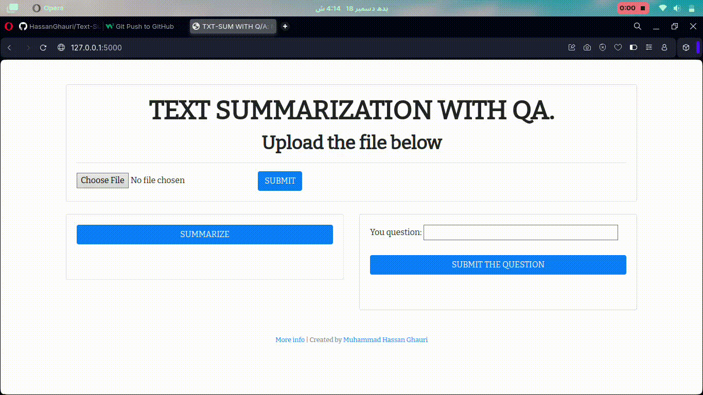

# Project "TXT-SUM WITH Q/A" #

"TXT-SUM WITH Q/A" ("Text Summarization with QA.")</i> project is a website which allows a user to upload a text document and:
* get it summarized or
* get answers to the user's questions based on the text provided.

Text is summarized following extractive summarization approach using distilbart-cnn-12-6 
(https://huggingface.co/sshleifer/distilbart-cnn-12-6), and question answering is implemented using a pre-trained machine learning model [BERT](https://en.wikipedia.org/wiki/BERT_(language_model)).

Frontend: HTML/CSS-Bootstrap/JS.
Backend: Python/Flask.

Source code: https://github.com/HassanGhauri/Text-Summarization-with-QA-System

I created this app as my [final project] in the [NLP] course and as my first acquiaintance with BERT and DistilBart.
